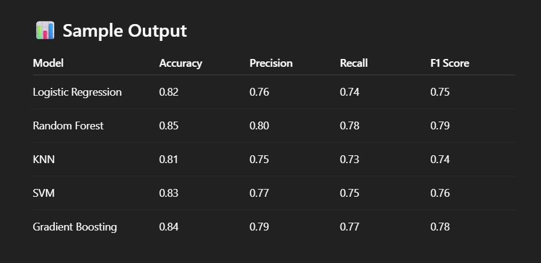

# 🧑‍💼 Employee Salary Prediction using Machine Learning

This project predicts whether an employee earns **more than 50K** or **less than or equal to 50K** annually based on various features like age, education, occupation, working hours, etc.

Additionally, the app estimates:
- **Approximate Annual Salary**
- **Estimated Income Tax**

---

## 📌 Problem Statement
Traditional methods of estimating salaries in HR departments are inefficient and subjective. A predictive model based on employee features can automate this process and provide data-driven insights.

---

## 🛠️ Technologies & Tools
- **Python 3.x**
- **Pandas**, **NumPy**: Data manipulation
- **Scikit-learn**: Machine Learning algorithms
- **Matplotlib**, **Seaborn**: Data visualization
- **Streamlit**: Interactive web app for predictions
- **Joblib**: Model serialization

---

## 🔍 Dataset
- **Source**: UCI Adult Income Dataset
- **Link**: [UCI Repository - Adult Dataset](https://archive.ics.uci.edu/ml/datasets/adult)

---

## ⚙️ ML Models Used
1. Logistic Regression
2. Random Forest Classifier
3. K-Nearest Neighbors (KNN)
4. Support Vector Machine (SVM)
5. Gradient Boosting Classifier

---

## 🚀 Project Workflow
1. **Data Preprocessing**
   - Handling missing values
   - Encoding categorical features

2. **Splitting the Data**
   - Training: 80%
   - Testing: 20%

3. **Model Training**
   - Trained and evaluated multiple models
   - Compared models using:
     - Accuracy
     - Precision
     - Recall
     - F1-Score

4. **Best Model**
   - **Random Forest Classifier** achieved the best accuracy.

5. **Streamlit App**
   - UI for inputting employee details.
   - Predicts income range, estimated salary, and tax.
   - Visual comparison of model performance.

---

## 🎯 How to Run the App
1. **Clone the Repository**
```bash
git clone https://github.com/yourusername/employee-salary-prediction.git
cd employee-salary-prediction
```
2. **Install Dependencies**
```bash
pip install -r requirements.txt
```
3. **Run the Streamlit App**
```bash
streamlit run app.py
```
---

## Sample Output


---

## Future Scope
- Predict actual salary instead of range.
- Deploy on cloud (AWS, Heroku).
- Add advanced visualization dashboards.
- Integrate deep learning models.

